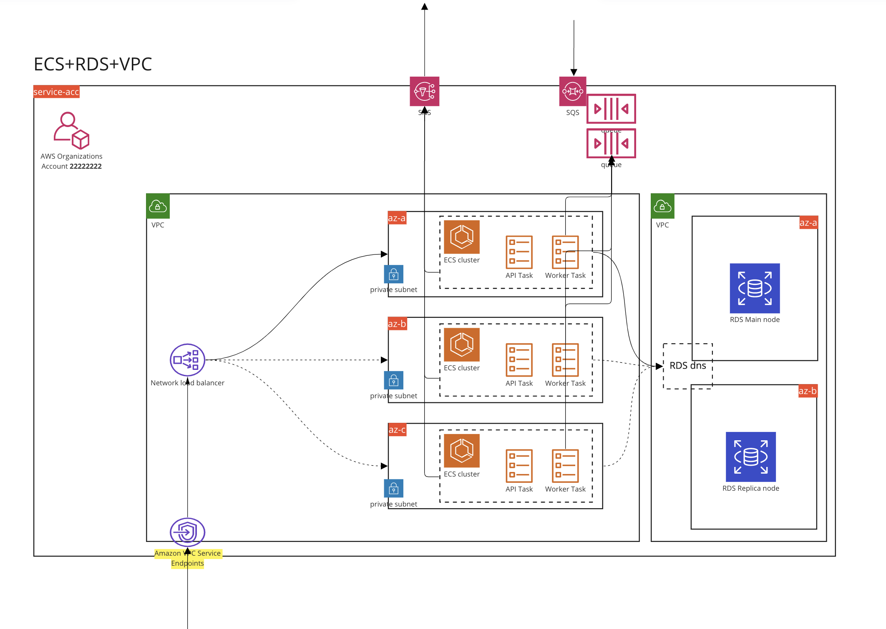

# ECS-RDS-Nest Terraform template

## Getting started

### What's included in the template

- [A bare bones NodeJS](./src) using [Nest](https://github.com/nestjs/nest), [Typescript](https://www.typescriptlang.org/) and [Prisma](https://www.prisma.io/)
- [Scripts to deploy the application to AWS](./infrastructure/) using [Terraform](https://www.terraform.io/) & [Terragrunt](https://terragrunt.gruntwork.io/)
- [Common Github Actions for CI/CD](./.github)

### Requirements

- NodeJS, ideally via a NodeJS version manager
- Docker
- If you are working on infrastructure components you might need to setup your environment as explained [here](./infrastructure/)

### Installing this template

1. Clone this repo `git@github.com:onlyfyio/ecs-rds-nest-tf-template.git`
2. Run the install script `bash scripts/install.sh`
3. Follow the instructions
4. `cd` into your new copy

```bash
git clone git@github.com:onlyfyio/ecs-rds-nest-tf-template.git
bash scripts/install.sh
```

### Manual customization [optional]

```sh
LC_ALL=C find . -type f -name '*.*' -exec sed -i '' s/your-service-name/new-service-name/g {} +
```

- Check more details in [here](./scripts/install.sh)


### Setting up your service

We provide a [Brewfile](./Brewfile) for all necessary dependencies:

```sh
brew bundle
```

Notice: NodeJS is not included in the `Brewfile` as typically this is installed in many different ways by preferences of developers.

### Architecture of what's deployed to your AWS account

#### Components

- [ECS](https://aws.amazon.com/ecs/) with [Fargate](https://aws.amazon.com/fargate/)
- [Container Registry](https://aws.amazon.com/ecr/)
- [RDS](https://aws.amazon.com/rds/)
- [Secrets Manager](https://aws.amazon.com/secrets-manager/)
- [VPC](https://aws.amazon.com/vpc/)
- [ALB & NLB](https://aws.amazon.com/elasticloadbalancing/)

#### Diagram



#### Digging deeper

For digging deeper in infrastructure topics please refer to our guides in https://github.com/onlyfyio/bss

## Nest application setup and development

### Installation

```bash
$ yarn install
```

### Running the app

Start local services:

```bash
make install
make start
```

```bash
# development
$ yarn run start

# watch mode
$ yarn run start:dev

# production mode
$ yarn run start:prod
```

### Executing the tests

```bash
# unit tests
$ yarn run test

# e2e tests
$ yarn run test:e2e

# test coverage
$ yarn run test:cov
```

### Running database migrations

Add the changes that you want in `prisma/schema.prisma`. To generate a new migration file run:

Once this file was changed, modify the `DATABASE_URL` from your `.env` file tu use the root user and run:

```
make db-migrate
```

### Database configuration

Add the changes that you want in `prisma/schema.prisma`.

Once this file was changed, modify the `DATABASE_URL` from your `.env` file tu use the root user and localhost instead of database and run:

```
make create-db-migration NAME=migration_name
```

### Deploying

When merging to main, a deploy to production is triggered automatically. We can also deploy to preview or sandbox environments by opening a pull request and commenting [deploy-sandbox] or [deploy-preview], this won't trigger any modification to sandbox and preview branches, just deploying the code from the PR.

Actually if code is pushed to preview or sandbox, a deploy will be also triggered. In the future it should be decided if we want to have one approach or both.

## Infrastructure setup and development

Check the infrastructure docs [here](./infrastructure/)


## Contributing to this template

Create a PR in the our [repo](https://github.com/onlyfyio/ecs-rds-nest-tf-template)

### New changes requirements

- Infrastructure changes on modules should be versioned following Semantic Versioning (be careful with breaking changes)
- Be tested in our Playground environments (`preview` and `sandbox`) before merging them to `master`

